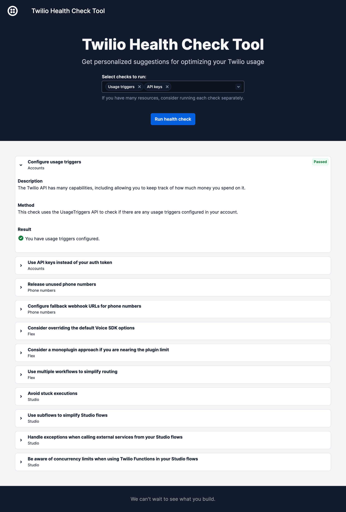

# Twilio Health Check Tool

Say hello to the Twilio Health Check Tool, your new best friend for optimizing your Twilio usage! It gives you recommendations and helps you scan your Twilio resources and compare their configuration with best practices.


## Usage

1. Install the [Twilio Serverless Toolkit](https://www.twilio.com/docs/labs/serverless-toolkit).
2. Clone this repository and navigate into the resulting directory.
3. Install the application's dependecies via `npm install`.
4. Run `npm run build-assets` to build the application.
4. Update the `.env.example` file with your Twilio account details and rename it to `.env`.
5. Run the app via `twilio serverless:run`.

That's it! Navigate to the `index.html` page (by default at http://localhost:3000/index.html) to run your health checks.

The tool is designed to be run locally, and it is not recommended to deploy it to Twilio Serverless, as some checks may take longer than the 10s Twilio Serverless execution limit, especially if you have a lot of resources in your account.


## Checks

### Current checks

Currently, the tool supports comparing your Twilio configuration with the following best practices:
- Configure usage triggers
- Use API keys instead of your auth token
- Release unused phone numbers
- Configure fallback webhook URLs for phone numbers
- Consider overriding the default Voice SDK options in Flex
- Consider a monoplugin approach if you are nearing the Flex plugin limit
- Use multiple workflows to simplify routing
- Avoid stuck Studio flow executions
- Use subflows to simplify Studio flows
- Handle exceptions when calling external services from your Studio flows
- Be aware of concurrency limits when using Twilio Functions in your Studio flows


### Adding custom checks

The tool can easily be extended with custom checks. To add your own check, 
1. Create a check definition file inside `src/checks`. See `CustomCheck.tsx` for an example that you can use as boilerplate.
2. Add a `case` for your check in `src/CheckFactory.tsx`: 
    ```
    case "customCheckId":
        return CustomCheck;
    ```
3. Add your check to the `checks` array inside `App.tsx`.


## Demo




## Deisclamer

The software is provided "as is", without warranty of any kind, express or implied, including but not limited to the warranties of merchantability, fitness for a particular purpose and noninfringement. in no event shall the authors or copyright holders be liable for any claim, damages or other liability, whether in an action of contract, tort or otherwise, arising from, out of or in connection with the software or the use or other dealings in the software.


## Maintainer

Thanks for reading this far!
If you have any questions, do not hesitate to reach out at `hello@slintab.dev`